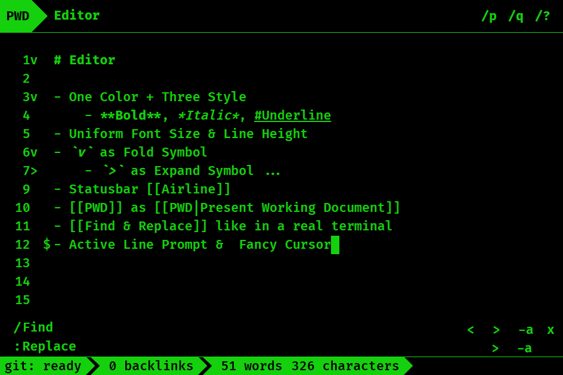

# Obsidian Terminal Theme

> An [Obsidian](https://obsidian.md) theme that *emulates* a terminal.

**[TOC]**

* [Features](#features)
* [Screenshots](#screenshots)
* [Current Limitations](#current-limitations)
* [Future & Thank You](#future--thank-you)

## Features

* Terminal Editor Style
    * One Color: `#15D00D`
        * Customizable through [mgmeyers' Style Settings](https://github.com/mgmeyers/obsidian-style-settings)!
    * One Font: Fira Code
    * Three Styles: <b>bold</b>, <em>italic</em>, <u>underline</u>
    * Uniform Font Size & Line Height
    * Fancy Cursor
    * Active Line Prompt
    * Find & Replace Like in a Real Terminal
* Statusbar [Airline](https://github.com/vim-airline/vim-airline)
* `PWD` as *Present Working Document*
* Open Command Palette & Quick Switcher like another terminal pane
* Open Suggestion Container & Page Preview in a [Peek Window](https://docs.microsoft.com/en-us/visualstudio/ide/how-to-view-and-edit-code-by-using-peek-definition-alt-plus-f12?view=vs-2019)
* Minimal UI
    * *Credit*: [kepano - Hider](https://github.com/kepano/obsidian-hider)
* Prompts Everywhere
    * `$` - Active Line
    * `/` - Find
    * `:` - Replace
* ASCII Everywhere
    * `v` - Fold
    * `>` - Expand, Selected, Next
    * `<` - Previous
    * `+` - Not Created Note
    * `*` - Pin Command
    * `+\`/`+/` - Show More
    * `x` - Close
    * `/q` - Quit
    * `/p`/`/e` - Preview/Edit Mode
    * `/?` - More Options
    * `PWD` - Present Working Document
    * `-a` - Apply to All
* **Easter Eggs**: There are several lovely creatures accompanying you in the terminal (OuO), go find them!

## Screenshots

---

---

---

## Current Limitations

> This theme is a synonym of *limitation* (XD); here I only list a few that I think are worth mentioning.

* Not optimized for preview mode.
* Not optimized for community plugins.
* Hider style rules are not able to toggle off.
    * For example, you lose the ribbon forever.
* There may be some misalignment and dettachment of elements.
    * I will repair ASAP!
    * Please report!
* Peek Window (suggestion & preview) will take up the full width.

## Future & Thank You

I will keep optimizing this theme. I already have some features in my mind that I want to implement soon:

* Address some of the above limitations
* More color schemes
* More Style Settings
* Support more plugins
* Mobile support
* Better prompts & ASCII symbols design and customization support

I also have some wild ideas such as building plugins that work with the theme to provide a more *terminal-ish* experience.

I want to say thank you for trying my theme. If you see any bugs or have any suggestions and feature requests, please file an issue on [GitHub](https://github.com/zcysxy/Obsidian-Terminal-Theme/issues) or just tag me `@Atlas#7560` on Discord, this theme won't be better without your generous help ;)
